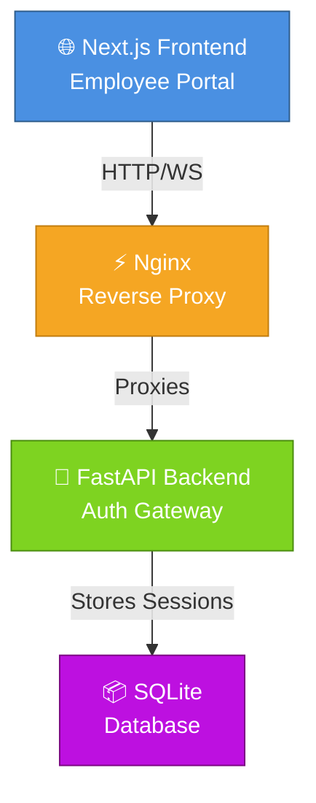

# Operation E.D.I.T.H

## 🛡️ Extraordinary Detection Intelligence Tactical Handling

*A sophisticated security challenge modeled after S.H.I.E.L.D./Stark Industries architectures*

---

## Overview

Operation E.D.I.T.H. is a multi-layered CTF challenge that requires participants to:

- **Extract & analyze** encrypted archives using cryptographic reconstruction
- **Reverse-engineer** custom bytecode and identify hidden secrets
- **Authenticate** against a live system using challenge-response protocols
- **Solve cryptographic puzzles** including zero-knowledge proofs and weak cryptography analysis
- **Decrypt a flag** using keys derived from successful completion of all prior stages

The challenge enforces genuine understanding through **perceptual gates** (live observation required) and **honest difficulty** — no deception, no tricks, pure cryptographic rigor.

---

## 🎯 Core Features

| Feature | Description |
| --- | --- |
| 🔐 **Unified Flag** | All participants converge to a single flag: `rvcectf{SH13LD_C0GN1T1V3_4UTH}` |
| 👁️ **Perceptual Gates** | Live observation required — visual sequences, waveform tuning, real-time transcription |
| 🔑 **Cryptographic Hardening** | 1024-bit RSA-style modulus, 2-round ZKP protocol (soundness 1/256), 24-bit proof-of-work |
| 📐 **Honest Anti-AI Design** | No adversarial text tricks, no punishing humans — purely difficulty-based |
| ⚡ **Rate Limiting** | 12 req/min for auth, 6 req/min for calibration (strict IP-based enforcement) |
| 🔒 **End-to-End Encryption** | AES-256-GCM flag encryption prevents plaintext discovery from source code |

---

## 🏗️ System Architecture



**Architecture layers:**

- **Frontend:** Next.js 16.2.9 with interactive UI (blink codes, waveform calibration, terminal)
- **Reverse Proxy:** Nginx for rate limiting, real IP resolution, WebSocket upgrade
- **Backend:** FastAPI with REST endpoints and WebSocket gateway for ZKP protocol
- **Persistence:** SQLite for session tokens, nonces, and rate-limit tracking

---

## 🔄 Challenge Flow

```mermaid
sequenceDiagram
    participant P as Participant
    participant Web as Portal
    participant API as Backend

    P->>Web: Download archive & broken script
    P->>P: Repair script using cryptography knowledge
    P->>P: Extract archive & analyze bytecode
    P->>P: Find steganographic offset in blueprints
    P->>Web: Compute HMAC & watch blink sequence
    Web->>API: Challenge-response authentication
    API-->>Web: Session token issued
    
    P->>Web: Adjust waveform sliders to match target
    Web->>API: Binary pass/fail verification
    API-->>Web: Unlock next phase
    
    P->>Web: Download PCAP & analyze weak DH
    P->>P: Factor prime & recover session key
    
    P->>Web: Navigate to Director terminal
    P->>P: Watch 20-second flash sequence
    P->>API: Connect via WebSocket with nonce
    P->>P: Solve CAPTCHA, complete 2-round ZKP
    P->>P: Brute-force proof-of-work challenge
    API-->>P: Receive AES-GCM encrypted flag
    
    P->>P: Assemble 6 key components
    P->>P: Decrypt flag using derived AES key
    
    style P fill:#E8F4F8
    style Web fill:#4A90E2,color:#fff
    style API fill:#7ED321,color:#fff
```

---

## 📂 Repository Structure

```text
Operation_E.D.I.T.H./
├── backend/                 # FastAPI application
│   ├── app/
│   │   ├── main.py         # HTTP endpoints & WebSocket handler
│   │   ├── config.py       # Cryptographic constants & secrets
│   │   ├── crypto.py       # HMAC, ZKP, RC4 implementations
│   │   ├── database.py     # Session & rate-limit persistence
│   │   └── captcha.py      # Visual CAPTCHA generation
│   ├── requirements.txt
│   └── Dockerfile
│
├── frontend/                # Next.js portal & terminal
│   ├── src/app/
│   │   ├── page.js         # Login & dashboard
│   │   ├── calibrate/      # Waveform tuning interface
│   │   └── director/       # Interactive terminal
│   ├── src/lib/            # Session validation
│   ├── package.json
│   └── next.config.mjs
│
├── nginx/                   # Rate limiting & reverse proxy
│   └── nginx.conf
│
├── challenge_assets/        # Pre-compiled artifacts
│   ├── auth_backup.sba     # Encrypted archive
│   ├── HYDRA_CAPTURE.pcapng # Weak DH network capture
│   └── friday_app.bin      # FridayVM bytecode
│
├── scripts/                 # Build & verification utilities
│   ├── generate_sba.py     # Archive compiler
│   ├── generate_pcap.py    # Network capture generator
│   ├── fridayvm_assembler.py
│   ├── math_verification.py
│   └── integration_test.py
│
├── docs/                    # Technical specifications
│   ├── SBA_File_Format_Spec.md
│   ├── Web_Portal_and_SCRP_Spec.md
│   ├── WebSocket_ZKP_and_Captcha_Spec.md
│   ├── FridayVM_Specification.md
│   ├── Flag_Decryption_and_Deployment_Spec.md
│   └── PCAP_Crypto_and_Timing_Glitch_Spec.md
│
├── docker-compose.yml      # Multi-container orchestration
└── CLAUDE.md               # Developer guide
```

---

## 🚀 Quick Start

### Prerequisites

- Docker & Docker Compose
- Python 3.12+ (for scripts)
- Wireshark or equivalent (for PCAP analysis)

### Deploy Stack

```bash
# Build and launch all services
docker compose up --build -d

# Verify health endpoint
curl http://localhost/health
# Expected: OK

# Access the portal
open http://localhost
```

### Local Development

```bash
# Terminal 1: Backend (FastAPI)
cd backend
pip install -r requirements.txt
DH_SERVER_PRIVATE=57382103 uvicorn app.main:app --reload

# Terminal 2: Frontend (Next.js)
cd frontend
npm install
npm run dev

# Terminal 3: Scripts & Testing
python3 scripts/math_verification.py
python3 scripts/integration_test.py
```

---

## ✅ Pre-Deployment Verification

Before deploying to production, verify:

```bash
# 1. Math verification (crypto correctness)
python3 scripts/math_verification.py

# 2. Integration test (full participant flow)
python3 scripts/integration_test.py

# 3. Docker stack health
docker compose up -d
curl http://localhost/health
curl http://localhost  # Frontend loads

# 4. Backend logs
docker logs edith-backend

# 5. Database schema initialized
# (auto-initialized on first backend startup)
```

**Expected results:**

- ✅ All math verification passes
- ✅ Integration test completes without errors
- ✅ Health endpoint returns "OK"
- ✅ Frontend HTML loads successfully
- ✅ No error logs in backend

---

## 📚 Documentation

All technical specifications are located in the `docs/` folder:

| Document | Scope |
| --- | --- |
| **docs/SBA_File_Format_Spec.md** | Binary archive format, RC4 encryption, RLE decompression |
| **docs/Web_Portal_and_SCRP_Spec.md** | SCRP challenge-response, blink codes, waveform calibration |
| **docs/WebSocket_ZKP_and_Captcha_Spec.md** | Fiat-Shamir ZKP, 2-round protocol, CAPTCHA, proof-of-work |
| **docs/FridayVM_Specification.md** | Custom VM bytecode, opcode definitions, password logic |
| **docs/Flag_Decryption_and_Deployment_Spec.md** | AES-GCM encryption, key derivation, deployment configuration |
| **docs/PCAP_Crypto_and_Timing_Glitch_Spec.md** | Weak Diffie-Hellman, factorization method, packet structure |

**Developer guides:**

- **CLAUDE.md** — Build commands, architecture overview, local development
- **PARTICIPANT_JOURNEY_VIVID.md** — Complete walkthrough from participant perspective

---

## 🔐 Security & Cryptography

### Flag Delivery

The flag is **never stored in plaintext**. It is encrypted with AES-256-GCM and delivered only after participants:

1. **Extract the archive** — Repair and run the provided script
2. **Analyze bytecode** — Understand custom VM and derive secrets
3. **Authenticate via SCRP** — Compute correct HMAC response
4. **Calibrate waveform** — Match reference signal visually
5. **Analyze PCAP** — Recover DH keys from weak parameters
6. **Solve ZKP proof** — Prove knowledge without revealing secrets
7. **Solve proof-of-work** — Find SHA256 collision (24 bits)

### Key Derivation

```
key_material = hex(s[0]) || hex(s[1]) || hex(s[2]) || hex(s[3]) || hex(y_round2) || str(pow_nonce)
AES_KEY = SHA256(key_material)
flag = AESGCM(AES_KEY).decrypt(nonce, ciphertext, aad=ws_nonce)
```

All six components are collected from different challenge stages — participants must understand the entire system to decrypt successfully.

---

## 🎓 Design Philosophy

| Principle | Implementation |
| --- | --- |
| **No Shortcuts** | Every gate requires solving the preceding challenge; no backdoors |
| **Perceptual Gates** | Visual observation (blink codes, waveform matching) prevents pure API automation |
| **Honest Difficulty** | No deceptive text tricks or punishing timeouts; pure cryptographic rigor |
| **Unified Flag** | All participants target the same plaintext; no per-team variations |
| **Single Source of Truth** | Configuration centralized in `backend/app/config.py` |
| **Cryptographic Verification** | Every step mathematically validated; no guessing |

---

## 🐛 Known Constraints

1. **DH_SERVER_PRIVATE required** — Must be set via environment variable at container startup

   ```bash
   export DH_SERVER_PRIVATE=57382103
   ```

2. **PCAP regeneration** — Requires `DH_SERVER_PRIVATE` to rebuild

   ```bash
   cd scripts && DH_SERVER_PRIVATE=57382103 python3 generate_pcap.py
   ```

3. **Rate limiting enforces X-Real-IP** — Nginx must set this header; direct backend access bypasses rate limiting

4. **Flash codes are nonce-bound** — Each session gets unique sequences; impossible to pre-compute

5. **Waveform calibration is visual-only** — No gradient feedback; binary pass/fail only

---

## 🤝 Support & Contribution

For issues, questions, or improvements:

1. Check the relevant spec in `docs/`
2. Review `CLAUDE.md` for development guidance
3. Run `scripts/integration_test.py` to verify your environment
4. Consult `PARTICIPANT_JOURNEY_VIVID.md` for complete flow understanding

---

## ⚔️ The Challenge Awaits

Every layer guards the next. Every gate prevents shortcuts. The flag belongs to those who understand the system.

🛡️ **S.H.I.E.L.D. Protocol Active** 🛡️
