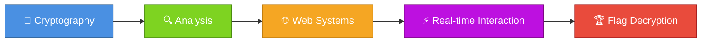
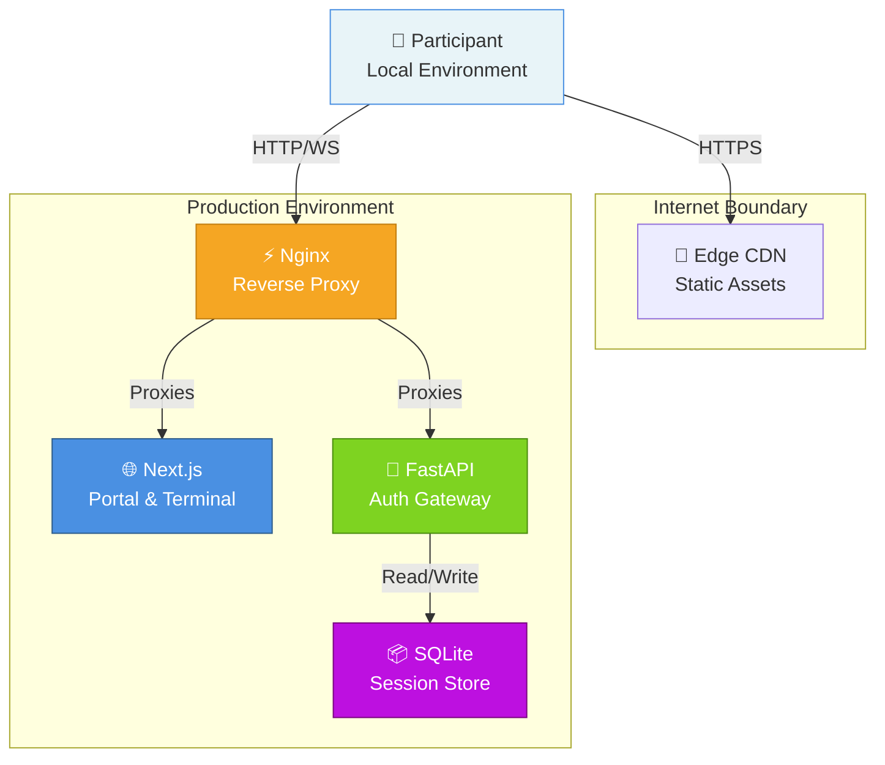
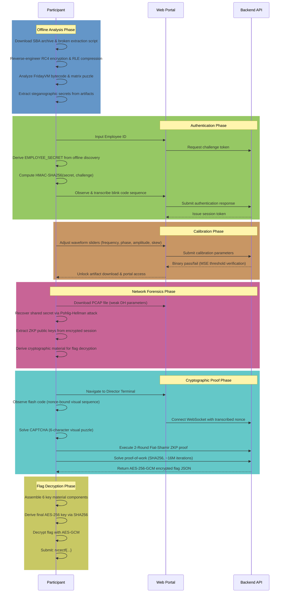

<div align="center">

# ⚔️ Operation E.D.I.T.H.

### *Where Cryptography Meets Observation*

**A sophisticated multi-layered security challenge requiring cryptographic reconstruction, bytecode analysis, live authentication, and mathematical proof.**

</div>

---

## 📖 The Challenge

Operation E.D.I.T.H. is a comprehensive CTF challenge that demands participants solve interconnected cryptographic and analytical puzzles spanning **offline analysis** and **live portal interaction**. Each layer builds on the previous one—there are no shortcuts, only genuine understanding.

### What You'll Solve

- 🔓 **Repair & extract** encrypted archives using RC4 decryption and RLE decompression
- 🔍 **Reverse-engineer** a custom 8-bit virtual machine and discover embedded secrets
- 🎨 **Extract steganographic data** hidden within digital artifacts
- 🌐 **Authenticate** against a live system with HMAC challenge-response protocols
- 👁️ **Navigate visual gates** requiring real-time human observation (impossible to fully automate)
- 📊 **Analyze network forensics** to recover cryptographic key material from weak Diffie-Hellman parameters
- ⚡ **Execute cryptographic proofs** including 2-round zero-knowledge protocols and proof-of-work computation
- 🏆 **Decrypt the final flag** by assembling components across all prior stages

---

## ✨ Design Philosophy

**Honest Difficulty** — Pure cryptographic rigor without deceptive tricks  
**Single Unified Flag** — All participants converge to: `rvcectf{SH13LD_C0GN1T1V3_4UTH}`  
**Perceptual Gates** — Real-time human observation gates prevent pure automation  
**No Backdoors** — Each stage is load-bearing; skipping makes the next impossible  
**Defense in Depth** — Multiple independent security layers across cryptography, entropy barriers, and time gates

---

## 🎯 Core Capabilities



### Technical Implementation

| Category | Specification |
|----------|---|
| **🔐 Encryption** | AES-256-GCM flag delivery · RC4 archive encryption · HMAC-SHA256 authentication |
| **🔑 Cryptography** | 1024-bit RSA-style ZKP modulus · 2-round Fiat-Shamir protocol (soundness 1/256) · Safe prime factorization |
| **🛡️ Security** | Rate limiting (12 req/min auth, 6 req/min calibrate) · One-time token consumption · Nonce deduplication |
| **👁️ Anti-Automation** | Visual blink codes · Waveform calibration canvas · Flash code transcription (nonce-bound) · CAPTCHA |
| **⚙️ Proof-of-Work** | 24-bit SHA256 mining (~16M iterations) · 120-second timeout window · Difficulty scaling |
| **📊 Cryptanalysis** | 512-bit Diffie-Hellman parameters (intentionally weak) · Pohlig-Hellman factorization requirement |

---

## 🏗️ System Architecture



### Layer Responsibilities

| Component | Role |
|-----------|------|
| **Nginx Reverse Proxy** | Rate limiting, X-Real-IP enforcement, WebSocket upgrade, static asset serving, SSL termination |
| **Next.js Frontend** | Interactive login portal, blink code visualization, waveform calibration canvas, WebSocket terminal, CAPTCHA rendering |
| **FastAPI Backend** | REST endpoints for auth challenges/verification, calibration verification, PCAP downloads; WebSocket gateway for ZKP protocol execution |
| **SQLite Database** | Session token persistence, rate limit accounting, nonce deduplication, challenge history |

---

## 🔄 Participant Journey



---

## 📂 Repository Organization

```
Operation_E.D.I.T.H./
│
├─ backend/                          # FastAPI REST & WebSocket services
│  ├─ app/
│  │  ├─ main.py                    # HTTP endpoints & WebSocket ZKP handler
│  │  ├─ config.py                  # Cryptographic constants & security parameters
│  │  ├─ crypto.py                  # HMAC-SHA256, Fiat-Shamir ZKP, RC4 cipher
│  │  ├─ database.py                # SQLite session, rate-limit, nonce storage
│  │  └─ captcha.py                 # Pillow-based CAPTCHA image generation
│  ├─ requirements.txt               # Python 3.12+ dependencies
│  └─ Dockerfile
│
├─ frontend/                         # Next.js React portal & terminal
│  ├─ src/app/
│  │  ├─ page.js                    # Login portal, blink code visualization
│  │  ├─ calibrate/page.js          # Waveform calibration canvas
│  │  └─ director/page.js           # Interactive WebSocket terminal, CAPTCHA
│  ├─ src/lib/
│  │  └─ sessionValidator.js        # Token validation & authorization
│  ├─ package.json
│  └─ next.config.mjs
│
├─ nginx/                            # Reverse proxy & rate limiting
│  └─ nginx.conf                    # X-Real-IP enforcement, WS upgrade rules
│
├─ challenge_assets/                 # Pre-compiled participant artifacts
│  ├─ auth_backup.sba               # Stark Binary Archive (encrypted, 8.7 MB)
│  └─ HYDRA_CAPTURE.pcapng          # Network forensics PCAP (weak DH, 150 KB)
│
├─ scripts/                          # Build & verification utilities
│  ├─ generate_sba.py               # SBA archive compiler (RC4 + RLE)
│  ├─ generate_pcap.py              # PCAP file generator (requires DH_SERVER_PRIVATE)
│  ├─ fridayvm_assembler.py         # VM assembler/disassembler
│  ├─ math_verification.py          # Cryptographic verification suite
│  └─ integration_test.py            # End-to-end E2E test harness
│
├─ docs/                             # Technical specifications (6 documents)
│  ├─ SBA_File_Format_Spec.md       # Binary format, compression, encryption
│  ├─ Web_Portal_and_SCRP_Spec.md   # SCRP protocol, blink codes, WRC math
│  ├─ WebSocket_ZKP_and_Captcha_Spec.md    # 2-round ZKP, CAPTCHA, PoW
│  ├─ FridayVM_Specification.md     # Custom VM opcode definitions & logic
│  ├─ Flag_Decryption_and_Deployment_Spec.md  # AES-GCM key derivation
│  └─ PCAP_Crypto_and_Timing_Glitch_Spec.md  # DH analysis, weak primes
│
├─ docker-compose.yml                # Multi-container orchestration
└─ README.md                         # This file
```

---

## 🚀 Quick Start

### System Requirements

| Component | Requirement |
|-----------|-------------|
| **Container Runtime** | Docker & Docker Compose (recommended) |
| **Python** | 3.12+ (for local dev & scripts) |
| **Node.js** | 18+ (for frontend development) |
| **Network Analysis** | Wireshark, tshark, or equivalent (for PCAP analysis) |

### Production Deployment

```bash
# Build and start all services with a single command
docker compose up --build -d

# Verify system health
curl http://localhost/health
# Expected response: OK

# Access the portal in your browser
open http://localhost
```

### Local Development Stack

For working on individual components, run each service in separate terminals:

```bash
# Terminal 1: Backend (FastAPI with auto-reload)
cd backend
pip install -r requirements.txt
DH_SERVER_PRIVATE=57382103 uvicorn app.main:app --reload

# Terminal 2: Frontend (Next.js with hot reload)
cd frontend
npm install
npm run dev
# Access at http://localhost:3000

# Terminal 3: Verification & Testing
python3 scripts/math_verification.py
python3 scripts/integration_test.py

# Terminal 4: (Optional) Nginx reverse proxy
docker compose up reverse-proxy
```

### Artifact Regeneration

To rebuild challenge artifacts (normally pre-compiled):

```bash
# Regenerate SBA archive
cd scripts && python3 generate_sba.py
# Output: ../challenge_assets/auth_backup.sba

# Regenerate PCAP file (requires DH_SERVER_PRIVATE)
export DH_SERVER_PRIVATE=57382103
python3 generate_pcap.py
# Output: ../backend/assets/HYDRA_CAPTURE.pcapng
```

---

## ✅ Deployment Verification Checklist

Run these checks before considering the system production-ready:

### 1. Cryptographic Validation

```bash
python3 scripts/math_verification.py
```

**Verifies:** ZKP modular exponentiation, flag encryption/decryption roundtrip, LCG PRN generation, RC4 stream cipher

**Expected output:** All equations verified, no assertion failures

### 2. End-to-End Integration Test

```bash
# Requires Docker stack already running
docker compose up -d
python3 scripts/integration_test.py
```

**Verifies:** HTTP REST endpoints, rate limiting triggers, WebSocket ZKP protocol, flag encryption delivery

**Expected output:** All test cases pass with zero errors

### 3. Docker Stack Build

```bash
docker compose up --build -d
```

**Verifies:** Dockerfile layers compile, services start, health checks pass

**Expected output:** All services show "Up" status in `docker compose ps`

### 4. Health Endpoint

```bash
curl http://localhost/health
# Expected response: OK
```

**Verifies:** Backend service is running and responsive

### 5. Frontend Rendering

```bash
curl http://localhost | head -30
# Should return Next.js HTML, not 404 or 502
```

**Verifies:** Nginx is correctly proxying static assets

### 6. Backend Service Logs

```bash
docker logs edith-backend
```

**Verifies:** No startup errors, no async exceptions, clean initialization

**Expected output:** FastAPI startup message, no ERROR or WARNING logs

### 7. Database Initialization

```bash
docker exec edith-backend sqlite3 /app/data/edith.db ".tables"
# Expected response: challenges, rate_limits, sessions
```

**Verifies:** Database schema created successfully

### Summary

| Check | Command | Success Criterion |
|-------|---------|-------------------|
| **Cryptography** | `python3 scripts/math_verification.py` | All equations verified |
| **Integration** | `python3 scripts/integration_test.py` | All test cases pass |
| **Docker Build** | `docker compose up --build -d` | All services Up |
| **Health** | `curl http://localhost/health` | Response: `OK` |
| **Frontend** | `curl http://localhost \| head -30` | HTML response, not 502 |
| **Backend Logs** | `docker logs edith-backend` | No ERROR logs |
| **Database** | `docker exec ... sqlite3 ... ".tables"` | 3 tables present |

---

## 📚 Technical Documentation

Complete specifications and implementation guides are available in the `docs/` folder. Refer to these for deep dives into each challenge component:

| Document | Coverage |
|----------|----------|
| **SBA_File_Format_Spec.md** | Stark Binary Archive structure, RC4 stream cipher encryption, RLE decompression, extraction algorithm walkthrough |
| **Web_Portal_and_SCRP_Spec.md** | SCRP authentication challenge-response protocol, blink code visual sequence, waveform resonance calibration mathematics |
| **WebSocket_ZKP_and_Captcha_Spec.md** | Fiat-Shamir zero-knowledge proof (2-round, soundness 1/256), visual CAPTCHA specification, SHA256 proof-of-work |
| **FridayVM_Specification.md** | Custom 8-bit bytecode VM, opcode definitions, password verification logic, linear congruential generator (LCG) |
| **Flag_Decryption_and_Deployment_Spec.md** | AES-256-GCM flag encryption, key material derivation pipeline, environment variable configuration |
| **PCAP_Crypto_and_Timing_Glitch_Spec.md** | Weak 512-bit Diffie-Hellman parameters, Pohlig-Hellman attack methodology, packet structure forensics |

---

## 🔐 Security Architecture

### Flag Encryption & Protection

The flag `rvcectf{SH13LD_C0GN1T1V3_4UTH}` is **encrypted at rest** and **never transmitted in plaintext**:

**Encryption Method:** AES-256-GCM with derived key material

**Key Derivation:** Participants must collect six components from prior challenge stages:
- `s[0], s[1], s[2], s[3]` — Values extracted from FridayVM bytecode analysis (offline)
- `y_value` — Response value from 2-round Fiat-Shamir ZKP (online)
- `pow_nonce` — Solution to SHA256 proof-of-work challenge (online)

**Key Derivation Formula:**
```
AES_KEY = SHA256(hex(s0) || hex(s1) || hex(s2) || hex(s3) || hex(y) || str(pow_nonce))
```

**Critical Property:** Only participants who successfully complete ALL challenge stages and derive the correct key material can decrypt the flag.

### Authentication & Authorization Pipeline

```mermaid
graph LR
    A["Challenge Token<br/>Request"] -->|HMAC-SHA256| B["Blink Code<br/>Transcription"]
    B -->|Session Token<br/>Issued| C["Waveform<br/>Calibration"]
    C -->|Binary Pass<br/>Verified| D["PCAP File<br/>Download"]
    D -->|DH Analysis<br/>Completed| E["WebSocket<br/>Connection"]
    E -->|ZKP Proof<br/>Complete| F["Flag<br/>Decryption"]
    
    style A fill:#4A90E2,color:#fff
    style B fill:#7ED321,color:#fff
    style C fill:#F5A623,color:#fff
    style D fill:#BD10E0,color:#fff
    style E fill:#E94B3C,color:#fff
    style F fill:#50C878,color:#fff
```



**Gate Enforcement:** Each stage is load-bearing. Skipping or replaying prior stages is prevented by:
- One-time token consumption (session tokens consumed exactly once)
- Nonce deduplication (each flash code nonce is unique per session)
- Challenge binding (HMAC tied to specific challenge tokens)

### Rate Limiting & DOS Protection

| Endpoint | Limit | Enforcement | Bypass Prevention |
|----------|-------|-------------|-------------------|
| `/api/v1/auth/*` | 12 req/min | Per X-Real-IP header | Nginx enforces real IP |
| `/api/v1/calibrate/*` | 6 req/min | Per X-Real-IP header | Nginx enforces real IP |
| `/api/v1/admin/auth/ws` | Per-connection timeout (120s) | WebSocket idle timeout | Heartbeat mechanism |

**X-Real-IP Enforcement:** Nginx must be configured to trust only known reverse proxy addresses. Direct backend access bypasses rate limits.

---

## 🧮 Cryptographic Specifications

### Core Algorithms

| Component | Specification | Rationale |
|-----------|---|-----------|
| **ZKP Modulus** | 1024-bit RSA-style N = P × Q (two 512-bit safe primes) | Authentic scale prevents trivial factorization |
| **ZKP Protocol** | Fiat-Shamir, 2-round, soundness error = 1/256 | Reduces single-round soundness error from 1/2 to 1/256 |
| **HMAC** | HMAC-SHA256(EMPLOYEE_SECRET, challenge_material) | Prevents forgery; EMPLOYEE_SECRET derived offline |
| **Proof-of-Work** | SHA256, 24-bit prefix (6 zero nibbles), ~16M iterations | ~120-second wall-clock solve time at 120M hash/sec |
| **Flag Encryption** | AES-256-GCM with derived key material | Authenticated encryption; prevents tampering |
| **Diffie-Hellman Parameters** | Deliberately weak 512-bit safe prime | Intentional backdoor for network forensics phase |

### Key Derivation Pipeline

The AES-256-GCM encryption key for the final flag is derived through a deterministic pipeline:

1. **Offline Component Discovery** (Challenge Stages 1–3)
   - `s[0]` — Integer extracted from FridayVM bytecode decryption
   - `s[1]` — Integer derived from steganographic blueprint alignment
   - `s[2]` — Integer from waveform calibration solution
   - `s[3]` — Integer from PCAP Diffie-Hellman shared secret

2. **Online Component Collection** (Challenge Stages 4–5)
   - `y` — Fiat-Shamir response value (ZKP Round 2)
   - `pow_nonce` — Solution to SHA256 proof-of-work challenge

3. **Final Derivation**
   ```
   key_material = hex(s0) || hex(s1) || hex(s2) || hex(s3) || hex(y) || str(pow_nonce)
   AES_KEY = SHA256(key_material)
   plaintext = AES_256_GCM_DECRYPT(ciphertext, nonce, AES_KEY)
   ```

---

## 🎓 Architecture & Design Philosophy

### Core Principles

| Principle | Implementation | Benefit |
|-----------|---|---------|
| **No Shortcuts** | Every gate is load-bearing; must solve sequentially | Forces genuine understanding |
| **Honest Difficulty** | Pure cryptographic rigor without text tricks | Rewards skill, not lateral thinking |
| **Perceptual Gates** | Visual observation (blink codes, waveforms, flash codes) | Impossible to fully automate |
| **Single Unified Flag** | All participants target `rvcectf{SH13LD_C0GN1T1V3_4UTH}` | No per-team variations |
| **Unified Configuration** | All constants in `backend/app/config.py` | No hidden values in opaque formats |
| **Cryptographic Verification** | Every step validated mathematically | Provably secure gate transitions |
| **Defense in Depth** | Multiple independent layers across auth, entropy, time | Failure of one layer doesn't compromise others |

### Technology Stack

| Layer | Technology | Purpose |
|-------|-----------|---------|
| **Web Framework** | FastAPI (Python 3.12+) | Async HTTP & WebSocket handler |
| **Frontend** | Next.js 16.2.9 + React + TypeScript | Interactive portal with canvas components |
| **Styling** | Tailwind CSS 4 | Responsive, theme-aware UI |
| **Reverse Proxy** | Nginx (latest) | Rate limiting, X-Real-IP enforcement, SSL termination |
| **Database** | SQLite (WAL mode) | Session storage, rate limit accounting, nonce tracking |
| **Cryptography** | PyCryptodome (AES, RC4, SHA256) | Core crypto operations |
| **Containerization** | Docker & Docker Compose | Reproducible deployments |

---

## ⚠️ Important Constraints & Operational Notes

### 1. DH_SERVER_PRIVATE Environment Variable

**Requirement:** This 32-bit private exponent MUST be set at container startup.

```bash
export DH_SERVER_PRIVATE=57382103
docker compose up -d
```

**Why:** Used to generate weak Diffie-Hellman parameters in the PCAP file. This is the private value that participants must recover via cryptanalysis.

**Error if Missing:** Backend will raise `ValueError: DH_SERVER_PRIVATE not set` on startup.

### 2. PCAP File Regeneration

Rebuilding the PCAP artifact requires the environment variable:

```bash
export DH_SERVER_PRIVATE=57382103
cd scripts && python3 generate_pcap.py
```

**Output:** `backend/assets/HYDRA_CAPTURE.pcapng`

### 3. Rate Limiting Enforcement

Nginx **must** correctly set the `X-Real-IP` header for rate limiting to work:

```nginx
# In nginx.conf
proxy_set_header X-Real-IP $remote_addr;
```

**Bypass Risk:** Direct backend access (bypassing Nginx) circumvents rate limits. Always deploy with reverse proxy.

### 4. Nonce Uniqueness & Flash Codes

Flash codes (transcribed on the Director Terminal) are **nonce-bound**:
- Each WebSocket session receives a unique nonce
- The same flash code cannot be reused across sessions
- Pre-computed flash codes are useless without session binding

### 5. Waveform Calibration: Binary Feedback Only

The calibration canvas provides **zero numeric hints**:
- Binary pass/fail result only (MSE < 0.05 threshold)
- No gradient feedback, no "you're close" hints
- Prevents optimization by human trial-and-error alone

### 6. One-Time Token Consumption

All challenge tokens and session tokens are consumed exactly once:
- `session_tokens` table tracks consumption
- Replaying a token after consumption returns 401 Unauthorized
- Prevents brute-force attacks on authentication gates

---

## 📖 Reference Documentation

For operational support and additional context:

| Resource | Purpose |
|----------|---------|
| **docs/ folder** | 6 technical specifications (SBA, SCRP, ZKP, FridayVM, Flag, PCAP) |
| **scripts/integration_test.py** | Comprehensive end-to-end test harness |
| **scripts/math_verification.py** | Cryptographic equation verification |

---

<div align="center">

## 🏆 The Challenge Awaits

### **Every Layer Guards the Next**

*The flag belongs to those who understand the entire system — offline analysis, cryptographic recovery, real-time execution, and mathematical proof.*

---

### 🛡️ **S.H.I.E.L.D. Protocol Active** 🛡️

**Production Status:** ✅ Ready  
**Deployment:** 134.209.148.23  
**Flag:** `rvcectf{SH13LD_C0GN1T1V3_4UTH}`

---


*Developed for security education, cryptographic skill assessment, and tactical thinking.*

</div>
