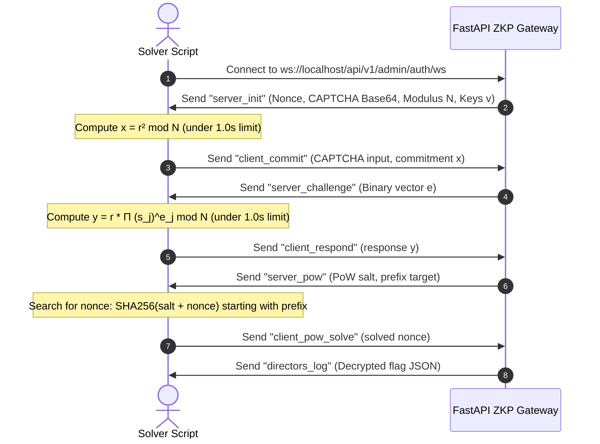

<div align="center">

# ⚙️ S.H.I.E.L.D. AUTH GATEWAY BACKEND ⚙️
### *FastAPI Cryptographic Verification Engine*

[](https://www.python.org)
[](https://fastapi.tiangolo.com)
[](https://www.sqlite.org)

---

</div>

## 🛡️ Core Services

The backend subsystem is built on **FastAPI** and **SQLite**, exposing the main APIs and live WebSocket protocols to process challenge requests and release encrypted flags.

### 1. Symmetric Challenge-Response Protocol (SCRP)
- **Challenge Issuance (`GET /api/v1/auth/challenge`)**: Returns a dynamic timestamped challenge payload, a salt value, and a unique transaction token.
- **Verification (`POST /api/v1/auth/verify`)**: Validates symmetrical HMAC-SHA256 tokens using the FridayVM employee secret, matched with a transient 3-character visual blink code calculated from 10-second timestamp rotations.

### 2. Isolated PCAP Gateway
- **Artifact Gating (`GET /api/v1/artifacts/hydra-capture`)**: Releases the network PCAP captures to logged-in employees, enforcing session limits and DB persistence mapping.

### 3. ZKP WebSocket Gateway (`/api/v1/admin/auth/ws`)
- Coordinates the 3-step administrative validation flow.
- Enforces strict **1-second timeouts** between messages to restrict human latency.

---

## 🔒 WebSocket Protocol Flow

The multi-round authentication steps for administrative validation are detailed below:



---

## 📁 Folder Structure

```
backend/
├── app/
│   ├── main.py        # Core FastAPI App & WebSocket handler
│   ├── crypto.py      # HMAC, Blink Code, and ZKP math implementations
│   └── config.py      # Static keys, modulus values, and secrets
├── requirements.txt   # Backend python dependencies
└── Dockerfile         # Deployment setup
```

---

## 🛠️ Local Development

### 1. Installation
Install requirements inside a virtual environment:
```bash
pip install -r requirements.txt
```

### 2. Run Local Development Server
Launch using uvicorn:
```bash
uvicorn app.main:app --host 0.0.0.0 --port 8080 --reload
```

---

<div align="center">

---
⚙️ **STARK INDUSTRIES FALLBACK SYSTEMS DIVISION** ⚙️
*Security clearance verification requires active key syncing at all times.*

</div>
