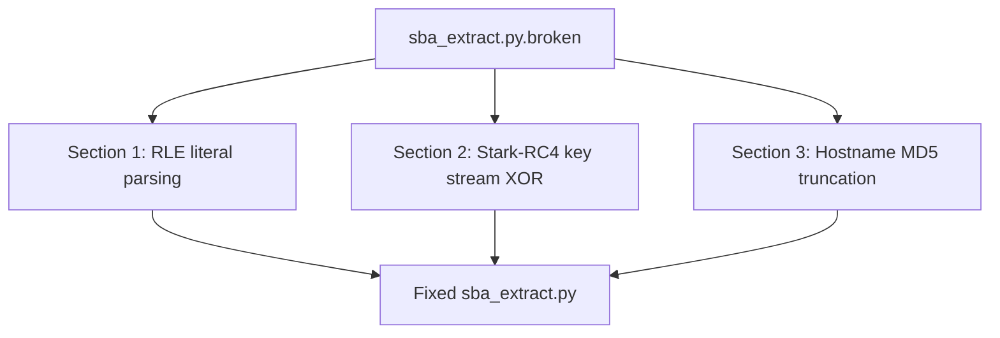

<div align="center">

# 📦 CHALLENGE ASSETS & INVESTIGATION ARCHIVES 📦
### *Recovered Stark Artifacts & Tools*

[](https://github.com)
[](https://github.com)

---

</div>

## 🔍 Investigation Files

This directory contains the core artifacts recovered from the Reyes laptop backup partition. Solvers must analyze these files to progress through the challenge.

### 1. `auth_backup.sba` (Stark Binary Archive)
A custom-format encrypted archive holding fallback system utilities.
- **Magic Signature**: `SBA\x00`
- **Compression**: Custom Run-Length Encoding (RLE).
- **Encryption**: Modified RC4 (Stark variant) keyed by a build server hostname.
- **Contents**:
  - `build_server.log`: Unencrypted compilation agent output.
  - `syslog.log`: Unencrypted NTP and system daemon log containing clock drift warnings.
  - `StarkEmployeePortal.exe`: Encrypted PE file containing the FridayVM passcode verification engine.
  - `README.txt`: Encrypted notice containing administrative directions.
  - `shield_blueprint_alpha.png`: Visual overlay layer for HUD key extraction.
  - `shield_blueprint_beta.png`: Visual overlay layer for HUD key extraction.

### 2. `sba_extract.py.broken` (Damaged Extraction Script)
The original extraction python tool found on the laptop, which has been intentionally defaced/corrupted. To run extraction, you must repair three damaged sections:



---

## 🛠️ Repair Specifications

### 💡 RLE Decompression
Reconstruct the escape byte sequence logic inside `rle_decompress`:
- **Escape marker**: `0xBC`
- **Literal rule**: `0xBC 0x00` $\rightarrow$ Emit literal `0xBC` byte.
- **Repeat rule**: `0xBC [len] [byte]` $\rightarrow$ Repeat `[byte]` for `[len]` occurrences.

### 💡 Stark-RC4 Decryption
Reconstruct the PRGA phase modification inside `stark_rc4_decrypt`:
- Standard RC4 is modified with an additional step during the key stream generation loop:
  $$j = (j + S[i]) \pmod{256}$$
  $$S[i], S[j] = S[j], S[i]$$
  $$j = (j \oplus \text{keystream-byte}) \pmod{256} \quad \text{<-- [MODIFICATION]}$$

### 💡 Key Derivation
Reconstruct the derivation inside `derive_rc4_key`:
- The symmetric key is the first `16` bytes of the **MD5 hash** of the unencrypted build server hostname.
- Extract the hostname first from the unencrypted `build_server.log` file using the partial parser.

---

## 🚀 Extraction Execution
Once the script is fully repaired, extract the contents to verify:
```bash
python3 sba_extract.py auth_backup.sba output_dir
```

---

<div align="center">

---
📦 **S.H.I.E.L.D. CYBER ARTIFACT VAULT** 📦
*Caution: Reconstructing corrupted archives may trigger warning trapdoors.*

</div>
