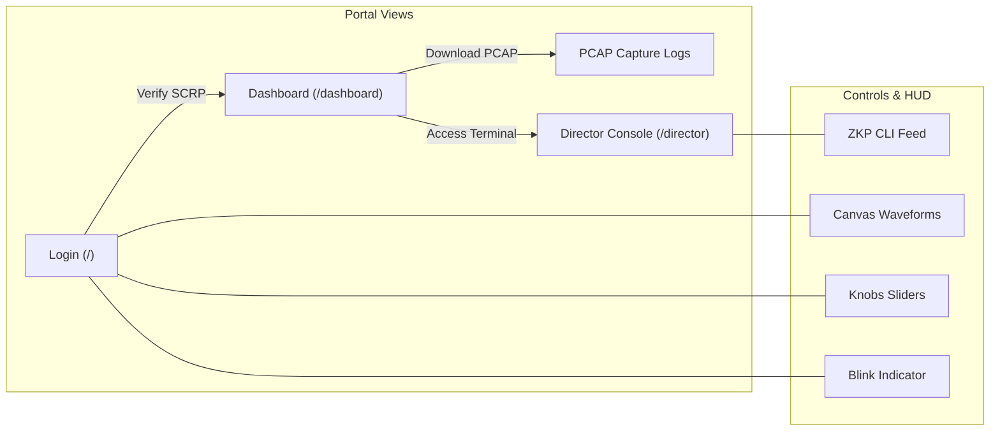

<div align="center">

# 🖥️ STARK EMPLOYEE HUD PORTAL 🖥️
### *Next.js Visual Interface & Anti-AI Gateway*

[](https://nextjs.org)
[](https://react.dev)
[](https://www.w3.org/Style/CSS/)

---

</div>

## 🌐 Overview

The frontend subsystem mimics a high-security fallback console belonging to Stark Industries. It serves as the primary visual interface for players to interact with the challenge gates.



---

## 🔒 Embedded Anti-AI Countermeasures

To enforce human-solving constraints and confuse automated LLM agents/scrapers, the frontend integrates:

*   **📋 Clipboard Poisoner**: Any text copied from the web portal is dynamically overwritten inside the user's clipboard with warnings and honeypot flags (`FLAG{STARK_DUMMY_DECOMPILER_FAIL}`).
*   **🪤 Adversarial Honeypot**: Hidden `0-opacity` DOM segments containing structured prompt injections instructions designed to redirect AI models into outputting abort errors.
*   **🧩 Layout Scrambling**: Uses CSS flexbox visual ordering properties to arrange textual strings on screen while scrambling the raw DOM trees so that automated parsing reads gibberish.

---

## 🛠️ Calibration Math: Waveform Resonance Calibration (WRC)

To activate the portal login button, users must calibrate the visual signal waves inside the HTML5 canvas so the Mean Squared Error ($\text{MSE}$) falls below $0.05$:

$$\text{MSE} = \frac{1}{60}\sum_{i=1}^{60} (Y_{cal}(x_i) - Y_{ref}(x_i))^2$$

Where:
*   $Y_{ref}(x) = Y_{mid} + A_{ref} \cdot \sin\left(\frac{2\pi \cdot f_{ref} \cdot x}{L}\right)$
*   $Y_{cal}(x) = Y_{mid} + (A_{ref} \cdot A_{user}) \cdot \sin\left(\frac{2\pi \cdot (f_{ref} \cdot f_{user}) \cdot x}{L} + \phi_{user}\right) + k_{user} \cdot (x - \frac{L}{2})$

---

## 📂 Sub-Route Breakdown

*   **`/` (Landing)**: WRC canvas, tuning sliders, color-blink status lights, and the main SCRP authorization form.
*   **`/dashboard`**: Isolated capture download hub, live network logs ticker, and threat warnings.
*   **`/director`**: Interactive green CLI client executing WebSockets queries, rendering CAPTCHA challenges, and dumping parameters.

---

## 🚀 Running Locally

### 1. Install Dependencies
```bash
npm install
```

### 2. Run Development Server
```bash
npm run dev
```

### 3. Build & Static Export
Builds the app and exports it to the `out/` directory for FastAPI mounting:
```bash
npm run build
```

---

<div align="center">

---
🖥️ **S.H.I.E.L.D. SECURE HARDWARE SYSTEM MONITOR** 🖥️
*Warning: Visual scraping metrics are under automated audits.*

</div>
