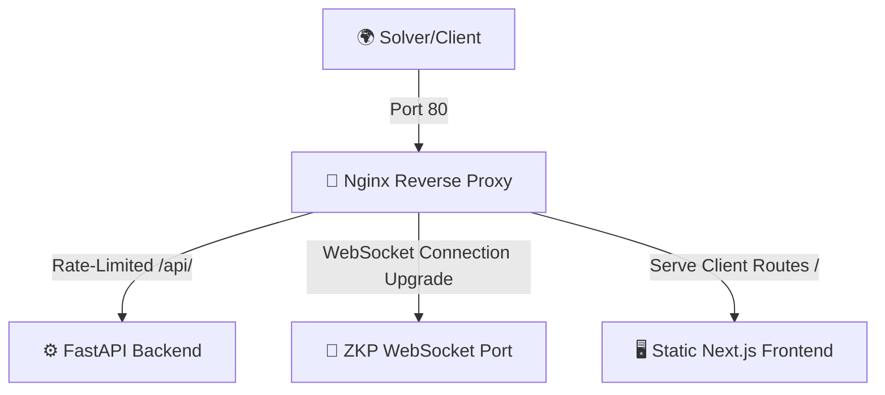

<div align="center">

# 🔀 S.H.I.E.L.D. REVERSE PROXY CONFIGURATION 🔀
### *Nginx Routing & Threat Rate-Limiting Configuration*

[](https://www.nginx.com)
[](https://nginx.org)

---

</div>

## 🌐 Role of the Proxy

The reverse proxy container is the entry point for all players and solvers. It manages network ingress, routes HTTP pages, handles WebSocket handshakes, and shields the backend from automated denial-of-service or script brute-forcing.



---

## 🛠️ Security Settings

### 1. Request Rate Limiting
To prevent brute-forcing of validation keys and secrets, Nginx establishes a shared memory zone:
- **Rate**: Maximum `12` requests per minute (`12r/m`).
- **Burst Gate**: Allows a brief burst of up to `5` requests with zero delay.
- **Scope**: Applied directly to `/api/v1/auth/verify` and `/api/v1/admin/auth/ws` routes.

```nginx
limit_req_zone $binary_remote_addr zone=auth:10m rate=12r/m;
```

### 2. WebSocket Upgrade Support
Handles connection upgrades required for Fiat-Shamir Zero-Knowledge interactive proofs:
```nginx
proxy_set_header Upgrade $http_upgrade;
proxy_set_header Connection "upgrade";
```

### 3. Timeout Rules
Maintains open WebSocket handshakes while preserving memory boundaries:
- **Read Timeout**: `120s`
- **Send Timeout**: `120s`

---

<div align="center">

---
🔀 **S.H.I.E.L.D. INGRESS CONTROL TACTICAL UNIT** 🔀
*Access logs are recorded under strict audit protocols.*

</div>
