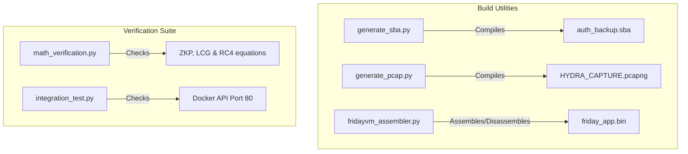

<div align="center">

# 🛠️ SYSTEM SCRIPT SUITE & BUILD UTILITIES 🛠️
### *Challenge Compilation & Verification Suite*

[](https://github.com)
[](https://github.com)

---

</div>

## 🔧 Scripts Overview

This folder contains the python scripts used to pack challenge assets, generate network captures, disassemble custom virtual machine bytecode, and perform integration verifications.



---

## 📖 Sub-Script Reference

### 1. `fridayvm_assembler.py`
The assembler, disassembler, and emulator for the custom **FridayVM** architecture.
- **Assemble code**:
  ```bash
  python3 scripts/fridayvm_assembler.py assemble source.asm output.bin
  ```
- **Disassemble bytecode**:
  ```bash
  python3 scripts/fridayvm_assembler.py disassemble input.bin output.asm
  ```
- **Emulate bytecode**:
  ```bash
  python3 scripts/fridayvm_assembler.py run input.bin
  ```

### 2. `generate_sba.py`
Generates the Stark Binary Archive `auth_backup.sba`. It reads unencrypted log files and WednesdayVM compiled binaries, compresses them via custom Run-Length Encoding (RLE), encrypts them using the Stark-RC4 algorithm, and appends the Table of Contents header structure.
- **Run compiler**:
  ```bash
  python3 scripts/generate_sba.py
  ```

### 3. `generate_pcap.py`
Generates `HYDRA_CAPTURE.pcapng` simulating a network key exchange between two agents using a weak Diffie-Hellman implementation.
- **Run generator**:
  ```bash
  python3 scripts/generate_pcap.py
  ```

### 4. `math_verification.py`
A stand-alone mathematical proof suite. It executes checks verifying the Stark-RC4 key derivations, LCG value derivations, and modular exponentiation relationships used in the ZKP.
- **Run proof verifier**:
  ```bash
  python3 scripts/math_verification.py
  ```

### 5. `integration_test.py`
End-to-end integration test verifying HTTP REST APIs, authentication endpoints, static file hosting, rate limit triggers, and raw WebSocket proofs against a running Docker container stack.
- **Run tests**:
  ```bash
  python3 scripts/integration_test.py
  ```

---

<div align="center">

---
🛠️ **S.H.I.E.L.D. TACTICAL TESTING DIVISION** 🛠️

*Verify all system components locally before running container deployments.*

</div>
